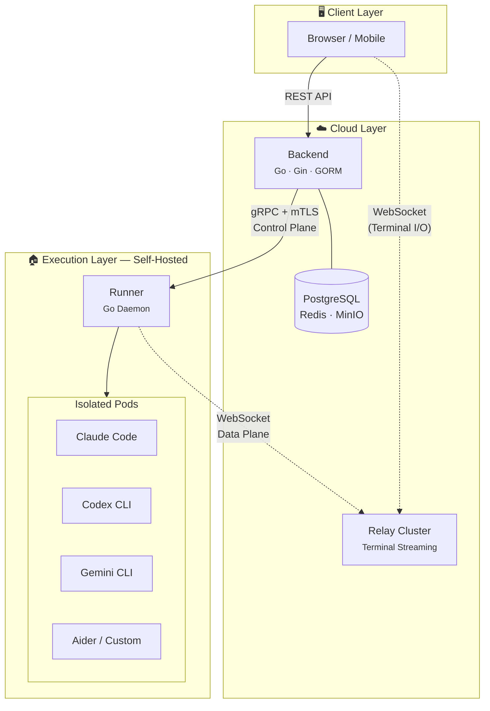

<p align="center">
  
</p>

<h3 align="center">AI Agent Fleet Command Center</h3>

<p align="center">
  Orchestrate AI coding agents. Ship code faster.<br/>
  Run and coordinate Claude Code, Codex CLI, Gemini CLI, Aider and more — from a single platform.
</p>

<p align="center">
  <a href="https://agentsmesh.com">Website</a> ·
  <a href="https://agentsmesh.com/docs">Docs</a> ·
  <a href="#quick-start">Quick Start</a> ·
  <a href="https://discord.gg/agentsmesh">Discord</a>
</p>

<p align="center">
  <a href="https://github.com/AgentsMesh/AgentsMesh/actions/workflows/ci.yml"></a>
  <a href="https://github.com/AgentsMesh/AgentsMesh/blob/main/LICENSE"></a>
  <a href="https://hub.docker.com/u/agentsmesh"></a>
</p>

---

## What is AgentsMesh?

AgentsMesh is an **AI Agent Fleet Command Center** — a platform that enables teams to run, manage, and coordinate AI coding agents at scale.

Instead of running agents one-at-a-time on your local machine, AgentsMesh lets you spin up **remote AI workstations (AgentPods)**, orchestrate **multi-agent collaboration** through channels and pod bindings, and track everything via integrated **task management** — all from a single web console.

**BYOK (Bring Your Own Key)** — You provide your own AI API keys. No usage caps. Full cost control.

## Features

- **AgentPod** — Remote AI workstations with web terminal, Git worktree isolation, and real-time streaming. Run multiple concurrent pods.
- **Multi-Agent Collaboration** — Coordinate agents through channels and pod bindings. Visualize the collaboration topology in real-time.
- **Task Management** — Kanban board with ticket-pod binding, progress tracking, and MR/PR integration.
- **Self-Hosted Runners** — Deploy runners on your own infrastructure. Your code never leaves your environment.
- **Multi-Agent Support** — Claude Code, Codex CLI, Gemini CLI, Aider, OpenCode, and any custom terminal-based agent.
- **Multi-Git Provider** — GitLab, GitHub, and Gitee integration.
- **Multi-Tenant** — Organization > Team > User hierarchy with row-level isolation.
- **Enterprise Ready** — SSO, RBAC, audit logs, air-gapped deployment support.

## Getting Started

The fastest way to use AgentsMesh is through our hosted service at **[agentsmesh.ai](https://agentsmesh.ai)** — sign up, connect your Git provider, and start running agents in minutes.

### 1. Install the Runner

The Runner is a lightweight daemon that runs on your machine and executes AI agents locally. Your code stays on your infrastructure.

**macOS (Homebrew):**

```bash
brew tap AgentsMesh/homebrew-tap
brew install agentsmesh-runner
```

**Linux / macOS (direct download):**

```bash
# macOS (Apple Silicon / Intel universal binary)
curl -fsSL https://github.com/AgentsMesh/AgentsMesh/releases/latest/download/agentsmesh-runner_darwin_all.tar.gz | tar xz
sudo mv agentsmesh-runner /usr/local/bin/

# Linux x86_64
curl -fsSL https://github.com/AgentsMesh/AgentsMesh/releases/latest/download/agentsmesh-runner_linux_amd64.tar.gz | tar xz
sudo mv agentsmesh-runner /usr/local/bin/

# Linux ARM64
curl -fsSL https://github.com/AgentsMesh/AgentsMesh/releases/latest/download/agentsmesh-runner_linux_arm64.tar.gz | tar xz
sudo mv agentsmesh-runner /usr/local/bin/
```

**Linux packages:**

```bash
# Debian / Ubuntu
wget https://github.com/AgentsMesh/AgentsMesh/releases/latest/download/agentsmesh-runner_linux_amd64.deb
sudo dpkg -i agentsmesh-runner_linux_amd64.deb

# RHEL / Fedora
wget https://github.com/AgentsMesh/AgentsMesh/releases/latest/download/agentsmesh-runner_linux_amd64.rpm
sudo rpm -i agentsmesh-runner_linux_amd64.rpm
```

### 2. Register

```bash
# Interactive — opens browser for authentication
agentsmesh-runner register

# Headless (SSH / remote server) — prints a URL to visit manually
agentsmesh-runner register --headless

# Token-based (CI / automation)
agentsmesh-runner register --token <REGISTRATION_TOKEN>
```

For self-hosted deployments, add `--server`:

```bash
agentsmesh-runner register --server https://your-server.com
```

### 3. Run

```bash
# Start the runner
agentsmesh-runner run

# Or install as a system service
agentsmesh-runner service install
agentsmesh-runner service start
```

Once the runner is online, create an **AgentPod** from the web console and start coding with your AI agents.

## Architecture

AgentsMesh separates **control plane** from **data plane** — orchestration commands travel through gRPC with mTLS, while terminal I/O streams through a Relay cluster.



| Component | Description |
|-----------|-------------|
| **Backend** | Go API server — auth, org/team management, pod lifecycle, task management |
| **Web** | Next.js frontend — dashboard, web terminal, kanban, topology visualization |
| **Relay** | Terminal relay cluster — low-latency WebSocket pub/sub between runners and browsers |
| **Runner** | Self-hosted Go daemon — connects to Backend (gRPC+mTLS) and Relay (WebSocket), runs AI agents in isolated PTY sandboxes |
| **Web-Admin** | Internal admin console — user/org/runner management, audit logs |

## Quick Start

### One-Command Setup (Docker)

```bash
git clone https://github.com/AgentsMesh/AgentsMesh.git
cd AgentsMesh/deploy/dev
./dev.sh
```

This starts the full stack: PostgreSQL, Redis, MinIO, Backend, Relay, Traefik, and a local Next.js frontend with hot reload.

**Access:**

| Service | URL |
|---------|-----|
| Web Console | http://localhost:3000 |
| API | http://localhost:80/api |

**Test Accounts:**

| Role | Email | Password |
|------|-------|----------|
| User | dev@agentsmesh.local | devpass123 |
| Admin | admin@agentsmesh.local | adminpass123 |

> Ports are dynamically allocated per worktree. Check `deploy/dev/.env` for actual values.

<details>
<summary><strong>Manual Setup</strong></summary>

**Prerequisites:** Go 1.24+, Node.js 20+, pnpm, Docker

```bash
# 1. Start infrastructure
cd deploy/dev && ./dev.sh

# 2. Backend (auto-starts in Docker with hot reload)
docker compose logs -f backend

# 3. Frontend (local with Turbopack)
cd web && pnpm install && pnpm dev
```

</details>

<details>
<summary><strong>Production Deployment</strong></summary>

Docker images are published to Docker Hub on every push to `main`:

```
agentsmesh/backend:sha-xxxxxxx
agentsmesh/web:sha-xxxxxxx
agentsmesh/web-admin:sha-xxxxxxx
agentsmesh/relay:sha-xxxxxxx
```

Tagged releases (`v*`) get semver tags:

```
agentsmesh/backend:1.0.0
agentsmesh/backend:1.0
```

See [deploy/selfhost/](deploy/selfhost/) for self-hosted deployment guide.

</details>

## Supported Agents

| Agent | Provider | Description |
|-------|----------|-------------|
| [Claude Code](https://docs.anthropic.com/en/docs/agents-and-tools/claude-code/overview) | Anthropic | Autonomous AI coding agent |
| [Codex CLI](https://github.com/openai/codex) | OpenAI | OpenAI's code generation CLI |
| [Gemini CLI](https://github.com/google-gemini/gemini-cli) | Google | Google Gemini CLI |
| [Aider](https://github.com/Aider-AI/aider) | Open Source | AI pair programming in the terminal |
| [OpenCode](https://github.com/opencode-ai/opencode) | Open Source | Open source AI coding tool |
| Custom | Any | Any terminal-based agent |

## Tech Stack

| Layer | Technology |
|-------|-----------|
| Backend | Go (Gin + GORM) |
| Frontend | Next.js (App Router) + TypeScript + Tailwind CSS |
| Database | PostgreSQL + Redis |
| Storage | MinIO (S3-compatible) |
| API | REST + gRPC (bidirectional streaming) |
| Security | mTLS for runner connections, JWT for web auth |
| Real-time | gRPC streaming (Runner ↔ Backend), WebSocket (Relay ↔ Browser) |
| Reverse Proxy | Traefik |

## Project Structure

```
AgentsMesh/
├── backend/          # Go API server
├── web/              # Next.js frontend
├── web-admin/        # Admin console (Next.js)
├── runner/           # Self-hosted runner daemon (Go)
├── relay/            # Terminal relay server (Go)
├── proto/            # Protocol Buffers definitions
├── ci/               # CI Dockerfiles
├── deploy/
│   ├── dev/          # Docker Compose dev environment
│   └── selfhost/     # Self-hosted deployment guide
└── docs/             # Architecture docs and RFCs
```

## Contributing

We welcome contributions! See [CONTRIBUTING.md](CONTRIBUTING.md) for guidelines.

- [Code of Conduct](CODE_OF_CONDUCT.md)
- [Security Policy](SECURITY.md)

## License

[Business Source License 1.1](LICENSE) (BSL-1.1)

- **Change Date:** 2030-02-28
- **Change License:** GPL-2.0-or-later

The BSL allows you to use, copy, and modify the software for non-production purposes. Production use requires a commercial license until the change date, after which the software becomes available under GPL-2.0-or-later. See [LICENSE](LICENSE) for the full terms and additional use grant.
